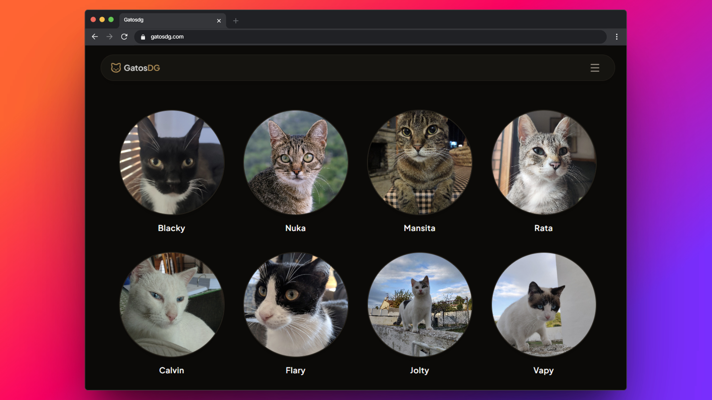

<div align="center">

# GatosDG



**A cozy family website dedicated to our cats, featuring individual profiles, photo galleries, and memories built with Next.js and Tailwind CSS.**

[Live demo](https://gatosdg.vercel.app/)

</div>

## 🐱 About the project

GatosDG is a small family website created to preserve the memories of all the cats that have been part of our lives.

Each cat has its own profile with photos, personal information, and a dedicated gallery.

The project focuses on clean design, fast performance, and an enjoyable browsing experience across all devices.

## 🐾 Features

- Individual profile page for every cat.
- Responsive photo galleries.
- Fullscreen lightbox for viewing images.
- Optimized thumbnails with high-resolution originals.
- Information cards with age or lifetime period.
- Support for current and former family cats.
- Image storage using Cloudflare R2.
- Responsive design for desktop, tablet and mobile.
- SEO-friendly metadata.
- Public read-only database powered by Supabase.

## 🛠️ Built With

- [Next.js](https://nextjs.org/)
- [Tailwind CSS](https://tailwindcss.com/)
- [Supabase](https://supabase.com/)
- [Cloudflare R2](https://www.cloudflare.com/products/r2/)
- [Yet Another React Lightbox](https://yet-another-react-lightbox.com/)
- [Vercel](https://vercel.com/)

## ⚡ Quick Start

You will need **Node.js** and **Git** installed globally.

### 1. Clone the repository

```bash
git clone https://github.com/leknod/gatosdg.git
```

### 2. Install dependencies

```bash
cd gatosdg
npm install
```

### 3. Start the development server

```bash
npm run dev
```

Open **http://localhost:3000** in your browser.

> This project depends on private Supabase and Cloudflare resources that are not included in the repository.

---

<div align="center">

[MIT License](https://github.com/leknod/arandoncel-com/blob/main/LICENSE) | [MarcDoncel.com](https://marcdoncel.com)

</div>
